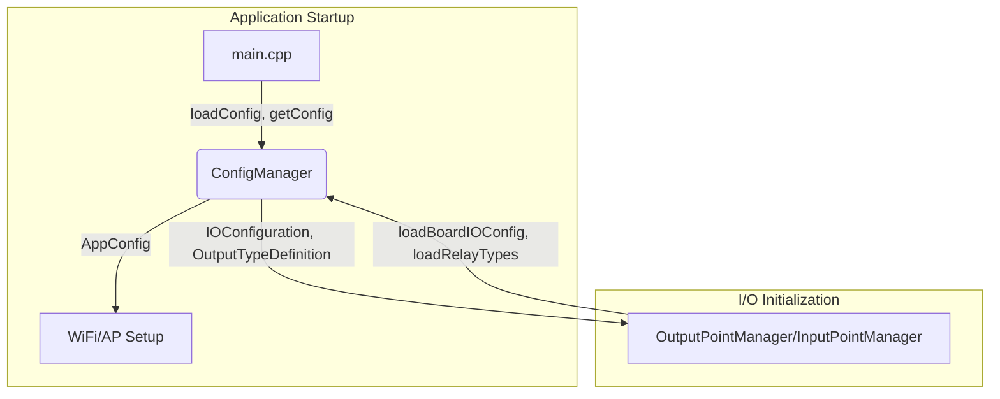

# ConfigManager Consolidation and Usage Pattern

## Overview

`ConfigManager` now serves a dual role in the project:

- **Legacy Application Config:** Manages WiFi, AP, and other system settings via `/config.json`.
- **Step 2 I/O Config:** Loads and parses hardware I/O configuration and relay types from `/data/board_config.json` and `/data/relay_types.json` for use by OutputPointManager, InputPointManager, and related classes.

---

## Legacy Application Config

- **Purpose:** Store and retrieve system-level settings (WiFi, AP credentials, etc.).
- **Methods:**
  - `bool loadConfig()`
  - `bool saveConfig()`
  - `AppConfig& getConfig()`
- **Usage:** Called at startup in `main.cpp` to load network settings, which are then used to initialize WiFi and AP modes.

**Example (from main.cpp):**
```cpp
if (!configManager.loadConfig()) {
  Serial.println("Failed to load configuration. Using defaults.");
}
WiFi.begin(configManager.getConfig().wifi_ssid.c_str(), configManager.getConfig().wifi_password.c_str());
```

---

## Step 2 I/O Config

- **Purpose:** Parse and provide access to direct I/O hardware configuration and relay types for the I/O managers.
- **Methods:**
  - `bool loadBoardIOConfig(IOConfiguration& ioConfig)`
  - `bool loadRelayTypes(std::vector<OutputTypeDefinition>& outputTypes)`
- **Usage:** Called by OutputPointManager, InputPointManager, or other new code to initialize hardware mappings and logic.

**Example:**
```cpp
IOConfiguration ioConfig;
if (configManager.loadBoardIOConfig(ioConfig)) {
  // Pass ioConfig to OutputPointManager, InputPointManager, etc.
}
std::vector<OutputTypeDefinition> relayTypes;
if (configManager.loadRelayTypes(relayTypes)) {
  // Use relayTypes for output point logic
}
```

---

## Coexistence and Backward Compatibility

- **No changes are needed in main.cpp or other code using the legacy config methods.**
- **New code** should use the new I/O config methods as needed.
- Both sets of methods can be used independently and safely in the same application.

---

## Summary Table

| Purpose                | Method(s)                                 | Used By                | File(s)                |
|------------------------|-------------------------------------------|------------------------|------------------------|
| App config (WiFi/AP)   | loadConfig, saveConfig, getConfig         | main.cpp, WiFi setup   | /config.json           |
| I/O config (Step 2)    | loadBoardIOConfig, loadRelayTypes         | Output/Input Managers  | /data/board_config.json, /data/relay_types.json |

---

## Diagram



---

## Notes

- All JSON parsing uses ArduinoJSON 7 APIs (no deprecated functions).
- The two config domains are logically separate but managed by the same class for convenience and code reuse.