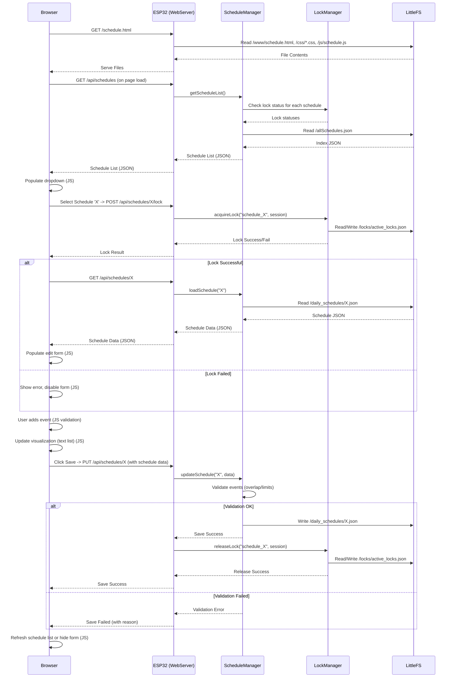

# ESP32 Secure Web App - Schedule Management Implementation Plan

This plan outlines the steps to implement schedule creation, editing, listing, and management features for the SNR System ESP32 web application.

**Assumptions & Clarifications:**

*   **Main Schedule Struct:** Contains `scheduleName` (String), `lightsOnTime` (int, mins since midnight), `lightsOffTime` (int, mins since midnight), `scheduleUID` (String), `autopilotWindows` (vector), `durationEvents` (vector), `volumeEvents` (vector).
*   **Time Format:** All times stored and processed as minutes since midnight (0-1439). Frontend handles HH:MM conversion.
*   **UID Generation:** Generated from sanitized schedule name + timestamp upon creation. Filename will be `{uid}.json`.
*   **Locking Levels:** Editing/deleting via API will be prevented if the schedule's lock level in `allSchedules.json` is 1 (locked by template) or 2 (locked by active cycle). `LockManager` handles the *editing* lock state.
*   **Visualization:** Initial implementation will use a sorted text list of events.
*   **File Paths:** Root of LittleFS is `/`. Paths used: `/allSchedules.json`, `/daily_schedules/`, `/www/`, `/www/js/`, `/www/css/`.
*   **Frontend Structure:** HTML, CSS, and JavaScript will be kept in separate files.

**Plan Phases:**

**Phase 1: Backend Data Structures & Manager Setup**
1.1. Create `include/ScheduleData.h`: Define structs `DurationEvent`, `VolumeEvent`, `AutoPilotWindow`, `Schedule`, `ScheduleFile`.
1.2. Create `include/ScheduleManager.h`: Define the `ScheduleManager` class interface (methods listed below).
1.3. Create `src/ScheduleManager.cpp`: Implement constructor, basic file path handling.
1.4. Modify `main.cpp`: Include `ScheduleManager.h`, create global `scheduleManager` instance, add `scheduleManager.begin()` call in `setup()`. Ensure `/daily_schedules/` directory is created in `setup()`.

**Phase 2: Schedule Index Management (`allSchedules.json`)**
2.1. Implement `ScheduleManager::loadScheduleIndex()`: Reads `/allSchedules.json`, parses into `std::vector<ScheduleFile>`. Handles file not found.
2.2. Implement `ScheduleManager::saveScheduleIndex()`: Writes `std::vector<ScheduleFile>` to `/allSchedules.json`.
2.3. Implement `ScheduleManager::maintainScheduleIndex()`: Syncs index with files in `/daily_schedules/`, updates lock status from `LockManager`, saves index.
2.4. Modify `ScheduleManager::begin()`: Call `loadScheduleIndex()` and `maintainScheduleIndex()`.

**Phase 3: Schedule Loading/Saving/Deleting**
3.1. Implement `ScheduleManager::loadSchedule(uid, Schedule&)`: Reads `/daily_schedules/{uid}.json`.
3.2. Implement `ScheduleManager::saveSchedule(const Schedule&)`: Writes `/daily_schedules/{uid}.json`.
3.3. Implement `ScheduleManager::deleteSchedule(uid)`: Deletes file, updates and saves index.

**Phase 4: API Endpoints (in `main.cpp`)**
4.1. `GET /api/schedules`: Implement `handleGetSchedules` (calls `scheduleManager.getScheduleList`).
4.2. `GET /api/schedules/{uid}`: Implement `handleGetSchedule` (calls `scheduleManager.loadSchedule`).
4.3. `POST /api/schedules`: Implement `handleCreateSchedule` (calls `scheduleManager.createSchedule`, `saveSchedule`, `maintainScheduleIndex`).
4.4. `PUT /api/schedules/{uid}`: Implement `handleUpdateSchedule` (checks index lock, acquires editing lock, validates events, calls `saveSchedule`).
4.5. `DELETE /api/schedules/{uid}`: Implement `handleDeleteSchedule` (checks index lock, calls `deleteSchedule`, releases editing lock).
4.6. `POST /api/schedules/{uid}/lock`: Implement `handleAcquireScheduleLock` (calls `lockManager.acquireLock`).
4.7. `DELETE /api/schedules/{uid}/lock`: Implement `handleReleaseScheduleLock` (calls `lockManager.releaseLock`).
4.8. Modify `registerRoutes()`: Add the new API endpoints.

**Phase 5: Frontend (HTML, CSS, JS Files)**
5.1. Create directories: `/data/www/js/` and `/data/www/css/`.
5.2. Create/Update CSS (`/data/www/css/`): Move existing styles, add styles for `schedule.html`.
5.3. Create/Update HTML (`/data/www/`):
    *   `index.html`: Link to CSS, link to `login.js`.
    *   `dashboard.html`: Link to CSS, link to `dashboard.js`. Add link to `schedule.html`.
    *   `schedule.html`: Create structure (dropdown, edit section, tabs, inputs, visualization area, buttons). Link to CSS, link to `schedule.js`.
5.4. Create JS (`/data/www/js/`):
    *   `login.js`: Login form logic.
    *   `dashboard.js`: Dashboard logic (user info, logout).
    *   `schedule.js`: Schedule page logic (init, load/edit, add event, save, cancel, lock handling, text visualization update), wrapped in `DOMContentLoaded`.

**Phase 6: Event Validation Logic (Backend)**
6.1. Implement validation logic within `ScheduleManager` (or helpers) for AutoPilot, Duration, Volume events (overlap, limits, time checks) as per requirements. Called by `handleUpdateSchedule`.

**High-Level Flow Diagram:**



**Class Diagram Snippet:**

```mermaid
classDiagram
    class ScheduleManager {
        +begin() bool
        +getScheduleList(vector<ScheduleFile>&) bool
        +loadSchedule(String uid, Schedule&) bool
        +saveSchedule(const Schedule&) bool
        +deleteSchedule(String uid) bool
        +createSchedule(String name, Schedule&) bool
        +validateAndAddEvent(Schedule&, const AutoPilotWindow&) bool
        +validateAndAddEvents(Schedule&, const vector<DurationEvent>&) bool
        +validateAndAddEvents(Schedule&, const vector<VolumeEvent>&) bool
        -loadScheduleIndex() bool
        -saveScheduleIndex() bool
        -maintainScheduleIndex() void
        -generateUID(String name) String
        -validateEventOverlap(...) bool
        -checkEventLimits(...) bool
        -vector<ScheduleFile> scheduleIndex
        -String scheduleDir = "/daily_schedules/"
        -String indexFile = "/allSchedules.json"
    }
    class Schedule {
        +String scheduleName
        +int lightsOnTime
        +int lightsOffTime
        +String scheduleUID
        +vector<AutoPilotWindow> autopilotWindows
        +vector<DurationEvent> durationEvents
        +vector<VolumeEvent> volumeEvents
    }
    ScheduleManager --> Schedule : uses
    ScheduleManager --> ScheduleFile : uses
    ScheduleManager --> LockManager : uses
    ScheduleManager --> LittleFS : uses
    ScheduleManager --> ArduinoJson : uses
    Schedule "1" *-- "0..*" AutoPilotWindow
    Schedule "1" *-- "0..*" DurationEvent
    Schedule "1" *-- "0..*" VolumeEvent